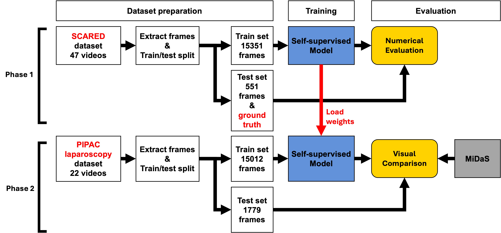
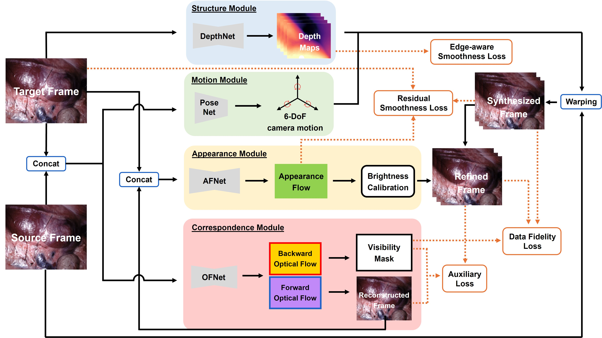
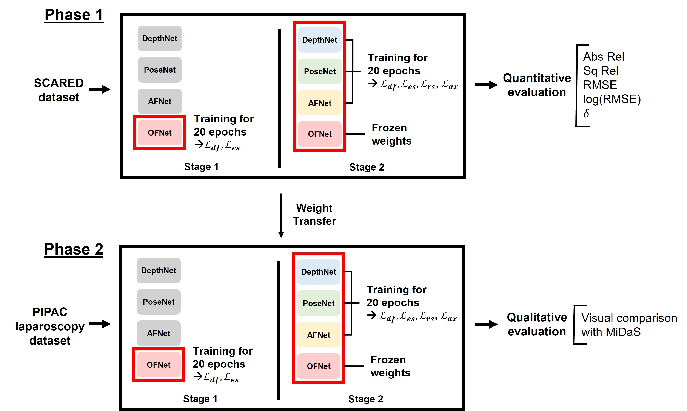

# Self-supervised Depth Estimation for Monocular Laparoscopic Surgery

This repository contains the implementation of the project _"Self-supervised Depth Estimation for Monocular Laparoscopy Videos"_. In this project, we investigate the performance and generalizability of a two-stage self-supervised training pipeline for predicting depth from monocular laparoscopic videos. Our method is based on the [AF-SfMLearner architecture](https://github.com/ShuweiShao/AF-SfMLearner/) and is evaluated on [SCARED dataset](https://endovissub2019-scared.grand-challenge.org/)-a high-quality, controlled endoscopic video dataset-and PIPAC Laparoscopy dataset, which represents real-world surgical data.

## Overview

<p align="center">


</p>

## Datasets

SCARED dataset
- Description: Porcine cadaver data with ground-truth depth and pose (Phase 1)
- Usage: Supervised evaluation + pretraining
- You can download the SCARED dataset on this [link](https://endovissub2019-scared.grand-challenge.org/) and follow the instructions. 
- For the dataset pre-processing, see the [link](https://github.com/ShuweiShao/AF-SfMLearner/) described by the author of AF-SfMLearner.

PIPAC Laparoscopy dataset
- Description: Real-world clinical videos from laparoscopic procedures (Phase 2)
- Usage: Fine-tuning on unlabeled data + qualitative testing
- Note that the PIPAC laparoscopy dataset is private and was collected under institutional approval at Ghent University Hospital. Access to the dataset is restricted due to ethical and privacy considerations.

## Requirements
We ran our experiments with PyTorch 1.11.0, torchvision 0.12.0, CUDA 11.5, Python 3.7.12 and Ubuntu 22.04.4.
You can install the required dependencies:
```
conda env create -f requirements.yaml
```

## Training Pipeline

<p align="center">

</p>

We adopt a two-phase training pipeline:
	•	Phase 1: Train on the SCARED dataset with ground-truth supervision
	•	Phase 2: Fine-tune on unlabeled PIPAC dataset using a self-supervised objective

The following is the example of the training pipeline:
```shell
# Phase 1 Training
CUDA_VISIBLE_DEVICES=0 python train_stage_one.py --data_path /your_data_path --model_name stage1 --split endovis2 --log_dir ./result
CUDA_VISIBLE_DEVICES=0 python train_stage_two.py --data_path /your_data_path --model_name stage2 --split endovis2 --log_dir ./result --load_weights_folder ./result/stage1/models/weights_19

# Phase 2 Training
CUDA_VISIBLE_DEVICES=0 python train_end_to_end.py --data_path /data_path_to_PIPAC --model_name pipac --log_dir ./result --split PIPAC_train --load_weights_folder /path_to_checkpoint/ 
```

## Evaluation
Similar to the training stage, we also used two different evaluation strategies.
For Phase 1, we performed quantitative evaluation as we have ground truth depth labels for SCARED dataset:

```shell
# Get numerical (quantitative) results:
CUDA_VISIBLE_DEVICES=0 python evaluate_depth.py --data_path /your_data_path/ --load_weights_folder /path_to_checkpoint/ --eval_mono --eval_split endovis2
```

For Phase 2, we performed visual comparison due to the absence of depth labels in the PIPAC laparoscopy dataset.
The following is the example code snippet to obatin depth maps:

```shell
# Get depth maps
CUDA_VISIBLE_DEVICES=0 python test_simple.py --model_path /path_to_checkpoint/ --image_path /path_to_input_frames/
```

## Key Findings
- Phase 1 model generalizes well on well-controlled, high-quality data (SCARED)
- Phase 2 model improves texture sensitivity but suffers from global inconsistency
- MiDaS struggles to capture surgical scenes accurately except for surgical instruments
- Our pipeline shows potential for clinical deployment, but further work is needed to improve robustness to occlusions, lighting variations, and anatomical diversity

## References

Shao, S., Pei, Z., Chen, W., Zhu, W., Wu, X., Sun, D., & Zhang, B. (2021). Self-Supervised monocular depth and ego-Motion estimation in endoscopy: Appearance flow to the rescue. Medical Image Analysis, 77, 102338. https://doi.org/10.1016/j.media.2021.102338 

